# Fitrio Fitness Tracker Application

The purpose of this application is to help people get fit and track their progress with simplified bodyweight circuit training that can be done at home. The world of exercise and fitness can be intimidating to newcomers and has many barriers to entry, like expensive equipment or overwhelmingly complicated routines.

This application aims to solve this problem by encouraging people to try more focused circuit training consisting of just three exercises per routine.

* Three basic routines are provided, using compound exercises selected to cover as broad a range of muscle groups as possible
* Users can add their own routines.
* The only equipment required for the provided routines is a pull-up bar, which is cheap and readily available.
* Workouts are time-limited and users record the number of exercises they completed in the time limit.
* Users can clearly see their progress as their recorded number of sets for each routine will gradually increase as they master the exercises and improve their fitness.

***

## User Experience

### New User Stories

* As a new user, I want to quickly understand the purpose of the site so that I can decide if it provides value to me.
* As a new user, I want to be able to quickly understand how to use the application to meet my needs.
* As a new user, I want clear instructions on how to perform the featured exercises and record my progress.
* As a new user, I want to know where to look for more information and help if I don’t understand something.

### Returning User Stories

* As a returning user, I want to be able to quickly access the features I’m interested in.
* As a returning user, I want to be able to easily access and manage the data I’ve saved in the application.
* As a returning user, I want to be able to create and manage my own custom routines
* As a returning user, I want to be able to assess my progress so I can see if the app is providing value for me
* As a returning user, I want to be able to share my achievements with others

### Design

The site uses the Materialize framework and features a dark mode design. I used the [Materialize dark theme](https://material.io/design/color/dark-theme.html) guidance to inform my design decisions, though I deviated from a strict, direct implementation of the guidance in a few areas.

#### Colours and Shades

* The site uses three shades of grey on the site’s surfaces to create a sense of depth. The darkest grey sits on the lowest visual level, with the mid grey in the middle and the lighter grey on the top level.

* The sense of depth is reinforced by consistent use of two levels of drop shadows on site elements. Elements with the shadow further from the element appear further from the surface they sit on, while elements with a closer drop shadow appear closer.

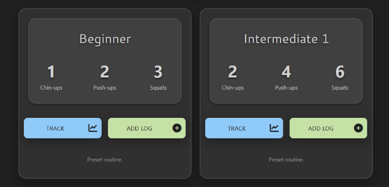

* I’ve tried to use shadows consistently, so card panels / surfaces in the mid grey colour sit far from their base layer, while the card panels/surfaces in the light grey sit closer to the mid grey surfaces beneath them. Buttons are always high above their parent elements for emphasis.

* In places, such as the graphs on the Track Progress pages, I’ve created a ‘cut-out’ effect using an inner drop shadow and colouring the inner element with the bottom grey shade.

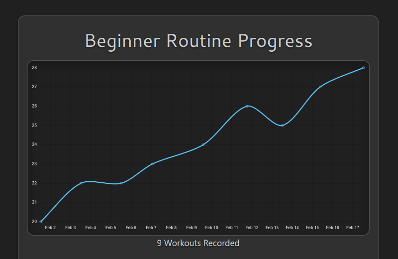

* In line with the Material Design dark theme guidance, I’ve used mostly light, desaturated colours.

* Colours are used consistently in association with a particular type of task:

* Light green is used on all buttons and flash messages associated with Create / Add operations, like adding a workout log or a new routine.

* Light blue is used on all buttons and flash messages associated with Read / Review operations, like searching the logs or tracking progress.

* Light amber is used on all buttons and flash messages associated with Update / Edit operations, like editing logs or routines, or updating sharing settings.

* Light red is used on all buttons and flash messages associated with Delete / Remove operations, like deleting logs or routines. Light red is also used for error messages.

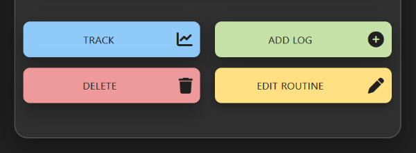

* A light grey is used for neutral buttons, like ‘Cancel’ buttons. This creates a clear visual contrast between confirmation and cancellation in the confirmation modals for editing or deleting records.

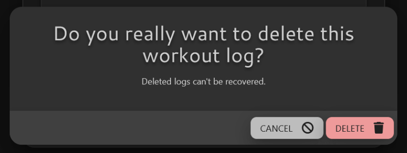

* Finally, a brighter, more saturated blue is used occasionally for emphasis. This is a brand colour and is used in the logo, on the progress graphs and to make links stand out.

#### Typography

* The site logo and headings use the [Cantarell font](https://fonts.google.com/specimen/Cantarell) from Google Fonts. This font was selected for its high legibility and simple, clean lines.
* All other text on the site uses the standard Materialize framework font stack, which consists of a number of simple, legible sans-serif fonts targeted at a range of different viewing devices and operating systems.

#### Imagery

* [Font Awesome 6](https://fontawesome.com/) icons are used throughout the site to illustrate buttons.
* Illustrative screenshots are included in the “how to log your workouts” section of the Getting Started page and in some FAQ sections.
* The “how it works” section of the Getting Started page is illustrated with drawings of clocks representing the time each stage should take. These illustrations were drawn as vectors with [Affinity Designer](https://affinity.serif.com/en-gb/designer/) in a style intended to match and complement the other site elements.

### Wireframes

The site is responsively designed to adapt to the user's viewing device. Wireframes for each page can be viewed [here](documentation/wireframes/).

***

## Features

### User Accounts

Fitrio features a user account system whereby users can create a persistent account, accessed by username and password, and store data associated with their account.

* Users create accounts by filling in a simple registration form.

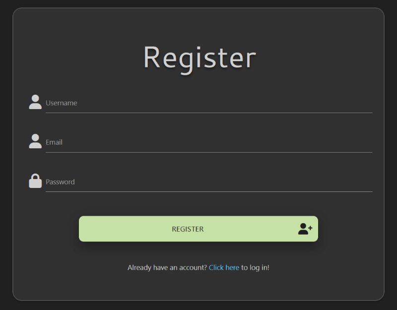

* Users sign in to their accounts by filling in a login form and sign out using a link in the navigation bar.

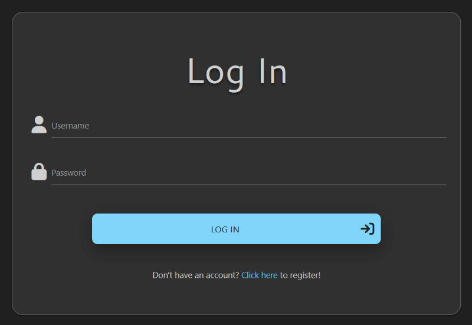

* The application uses the Flask session object to handle user login functionality and passwords are hashed using Werkzeug helper functions.

### Workout Log

The core feature of Fitrio is a workout log allowing users to record their workouts. Full CRUD (create, read, update, delete) functionality is implemented for workout logs, so users can add, delete and edit their records as they wish.

* Workouts logs are added by completing a form, which is linked to from buttons on the Workout Log and My Routines pages.

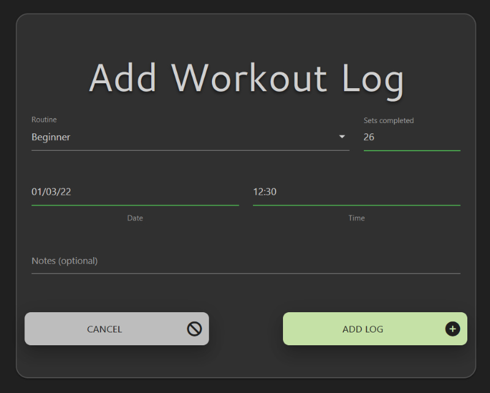

* All workout logs are listed on the Workout Log page.

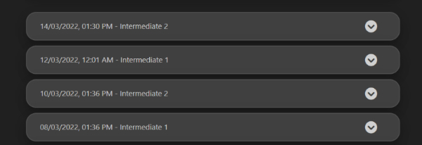

* The workout logs are paginated and displayed in batches of ten to prevent pages becoming too large as more records are added.

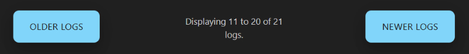

* Workout logs can be filtered by date

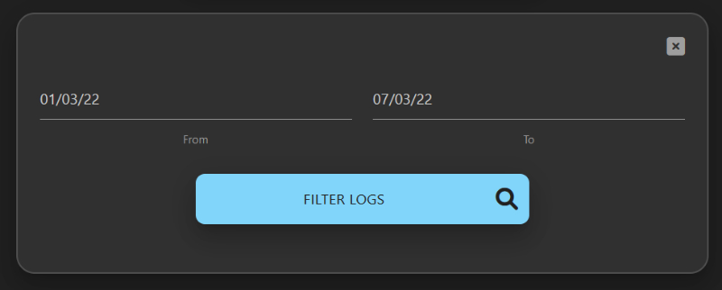

* Individual workout records can be expanded by clicking or pressing enter on the keyboard when focused. The app calculates and displays the total number of exercise reps that were done for each log entry. The record can be edited or deleted by clicking the buttons here.

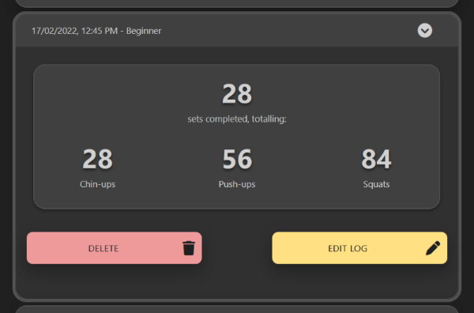

* When editing a log entry, the form is prepopulated with the current values of that log.

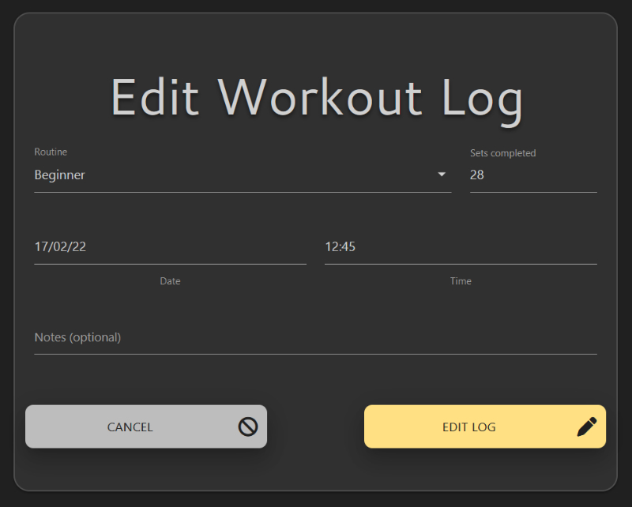

### Routine Management

A routine in Fitrio is a set of three exercises with an associated number of repetitions for each. Users select a routine whenever they log a workout.

* All users have access to three preset / default routines, which are displayed on the My Routines page and can be selected when adding a workout log.

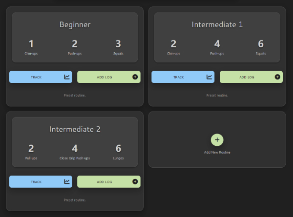

* By design, users cannot edit or delete the default routines, as they are intended to be the basic foundational routines of the application that all users always have access to. However, the ‘admin’ user account can add, edit or delete default routines. This allows the site admin to make changes to the preset routines or add additional preset routines that will be automatically applied to all other users.

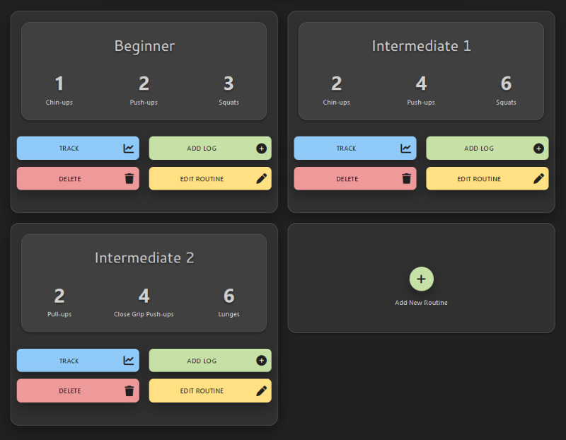

* Users can add their own custom routines by clicking the link in the My Routines page and then filling out a form.

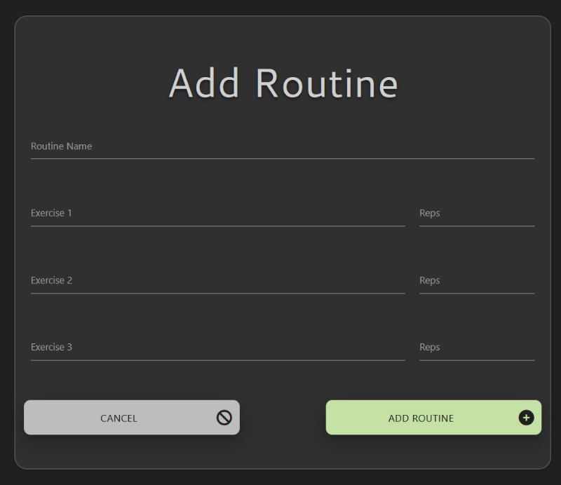

* Full CRUD functionality is implemented for users’ own custom routines. Custom routines can be deleted or edited by clicking the appropriate buttons on the My Routines page.

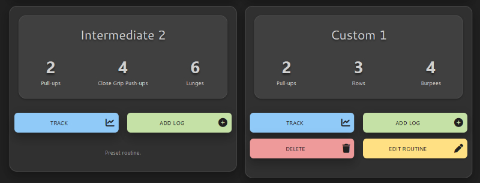

*  When editing a routine, the form is prepopulated with the current values of that routine.

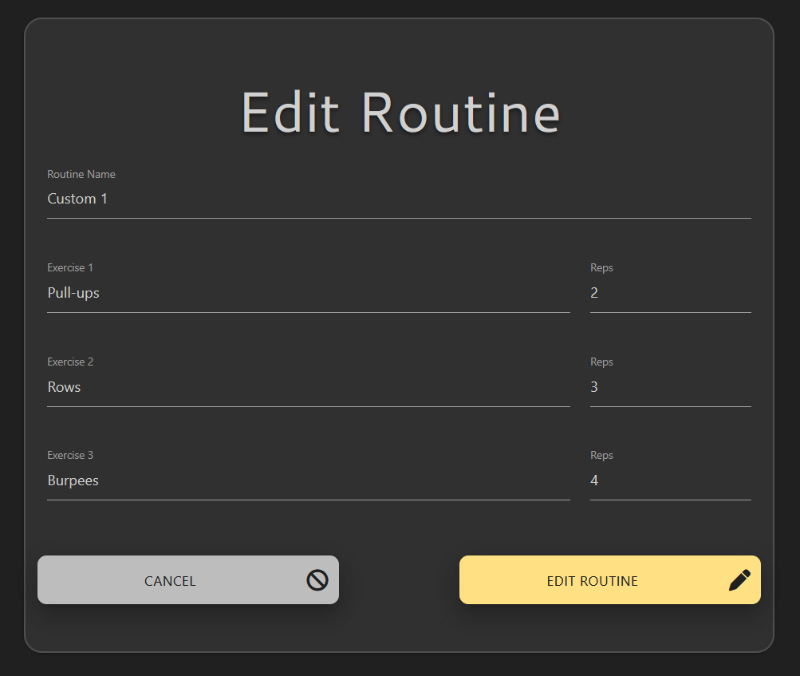

### Track and Share Progress

Users can track their progress with Fitrio routines (both preset and custom routines) by clicking the ‘Track’ link present on each routine on the My Routines page.

* Progress for each routine is visualised with a line chart. This chart plots the number of sets completed against the date/time for each workout logged by the given user with the given routine.

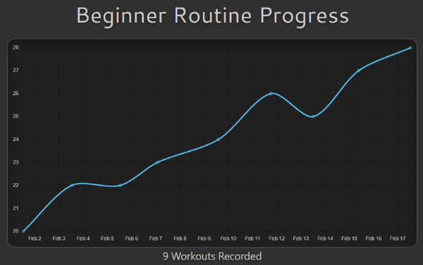

* A ‘personal best’ section displays the details of the workout with the highest number of sets that the user has recorded with this routine. Where multiple logs have the same highest number of sets, the log with the earliest date is used.

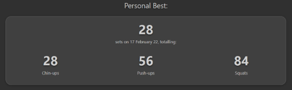

* By default, Track Progress pages cannot be viewed by any user except the page owner. However, users can click a “Share Page” button on the Track Progress page if they want to  share their progress. The page will then be viewable by any other logged in user who visits the page URL.

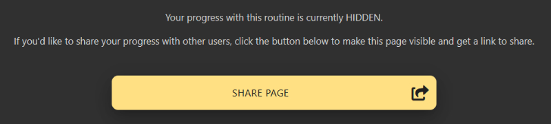

* For convenience, pages which are currently shared show a link that users can copy. The “Share Page” button is also replaced with a “Hide Page” button, which can be clicked to hide the page at any time. The “Hide Page” button is only visible to the page owner.

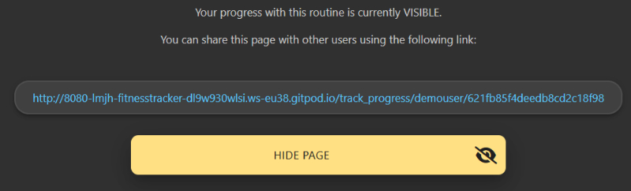

### Tutorials and FAQ

New users are redirected to a ‘Getting Started’ page after registration to help them learn how Fitrio works. An FAQ page is also provided with answers to common questions.

* The Getting Started page provides a step by step run down of how to use Fitrio workout routines.

* The Getting Started page also provides instructions on how to record workouts in the workout log and track progress.

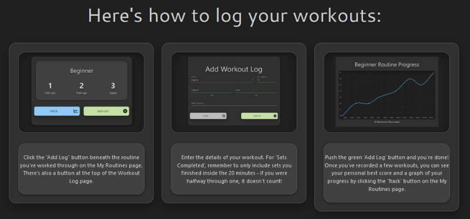

* The FAQ page provides answers to common questions in a collapsible accordion. Users can find detailed instructions for the exercises in the preset routines here.

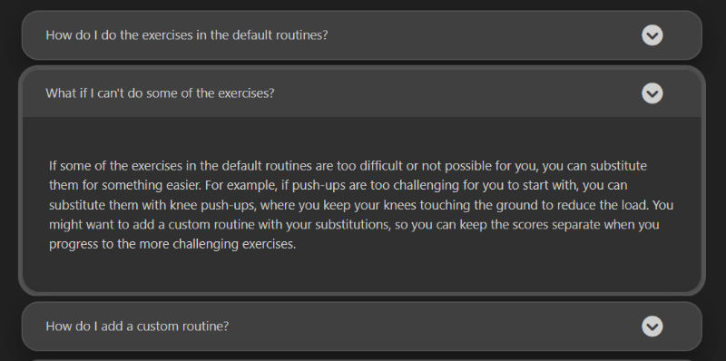

* Succinct instructions on how to use the features of the page are included at the top of the Workout Log and My Routines pages.

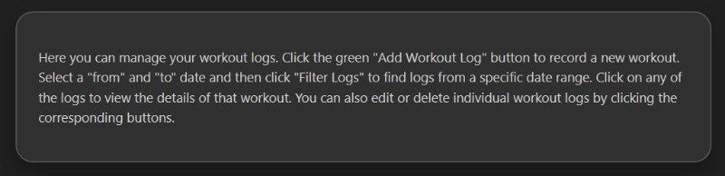

### Confirmation Modals

To mitigate the risk of accidental data loss, confirmation modals are used for all potentially destructive actions, including editing and deleting workout logs and editing and deleting custom routines.

* To ensure that the interface options are clear to users, the confirmation buttons are clearly labelled with the action to be taken and always match the colouring and icon of the action trigger button that was pressed. The cancel button is always in a neutral grey colour.

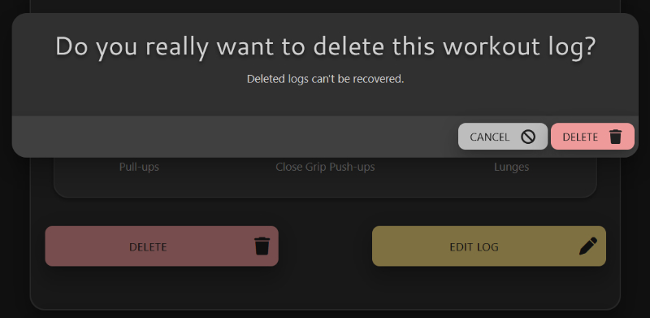

* A confirmation modal is also included for the action of updating the sharing settings on the Track Progress pages.

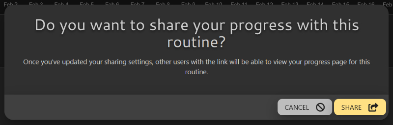

***

## Future Features

The following features could be added in the future, given more development time:

### 1. Account Management Tools

* Helpful account management tools could be provided, such as the ability to update usernames, email addresses and passwords.
* A password recovery function could also be provided. The [flask-security](https://pythonhosted.org/Flask-Security/features.html) extention can provide this functionality.

### 2. Additional Log Filters

* Users can currently filter the workout log page by date range, but additional filters could be provided.
* In particular, the ability to filter by routine could be helpful.
* Filtering by specific exercises or by notes content could also be considered.

### 3. More advanced graphs on Track Progress page

* Additional features could be added to the Track Progress graphs.
* Graphs currently chart all available data for the given routine, so the ability to request a specific date range could be useful.
* Other options include adding different types of graph.

### 4. Social media sharing

* Users can currently share their progress by turning on sharing for a track progress page and then sharing a link.
* It could be helpful to add share buttons from social networks to streamline the process of sharing.

### 5. Code optimization and refactoring

* This was my first major project using Python and Flask, so there are a few areas where I feel the code could be made neater and more efficient.
* In particular, more helper functions could be employed to avoid repeating common tasks across the different functions.

***

## Technologies

### Languages Used

* HTML5
* CSS3
* Javascript
* Python

### Frameworks, Libraries & Programs Used

1. [GitHub](https://github.com/) - Used for version control.
2. [GitPod](https://gitpod.io/) - Used to write all code and test before deploying to GitHub.
3. [Balsamiq](https://balsamiq.com/) - Used to produce design wireframes.
4. [Materialize](https://materializecss.com/) - Materialize CSS framework used extensively to create layout and styling of site.
5. [jQuery](https://jquery.com/) - Used to initialize Materialize componenents and validate select elements.
6. [Python 3.8](https://www.python.org/) - Used to code the application.
7. [MongoDB](https://www.mongodb.com/) - Used for the application's database.
7. [Flask](https://palletsprojects.com/p/flask/), [Jinja](https://jinja.palletsprojects.com/en/3.0.x/) and [Werkzeug](https://palletsprojects.com/p/werkzeug/) - Used to build the main application structure, page templates (Jinja) and account security (Werkzeug).
8. [PyMongo](https://github.com/mongodb/mongo-python-driver) - Used to connect Python with MongoDB
9. [Heroku](https://heroku.com/) - Used to deploy the site.
10. [Chart.js](https://www.chartjs.org/) - Used to render the routine progress charts.
11. [Regexr](https://regexr.com/) - Used to assist with writing and testing regular expressions.
12. [Affinity Designer](https://affinity.serif.com/en-gb/designer/) - Used to design logo and illustrations and to resize screenshots.

***

## Testing

Please see [TESTING.md](TESTING.md) for details of tests performed and bugs fixed.

***

## Deployment

***

## Other Credits and Acknowledgements
