# Testing of Fitrio Fitness Tracker
## Code Validation

* HTML code validated with W3C [HTML Validator](https://validator.w3.org/nu/).

* CSS code validated with W3C [CSS Validator](https://jigsaw.w3.org/css-validator/).

* Javascript code validated with [JSHint](https://jshint.com/).

* Python code validated with [PEP8 Online](http://pep8online.com/).

### HTML Validation

Because the raw html files contained jinja template code which would prevent proper validation, HTML validation was done by opening the page to be validated in a browser, then copying the source code and pasting into the W3C HTML Validator.

| Page                 |                                 Screenshot                                 | Notes               |
|----------------------|:--------------------------------------------------------------------------:|---------------------|
| home.html            | 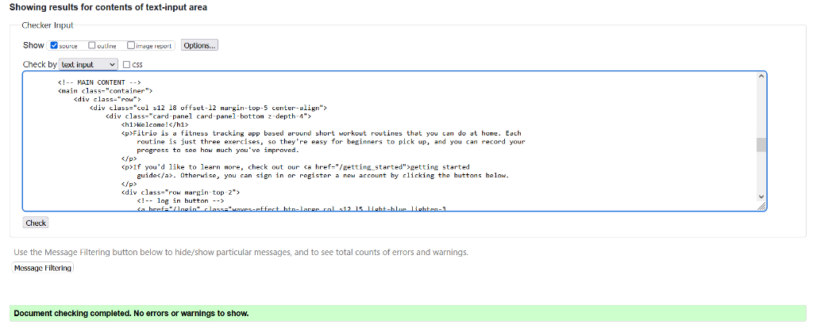            |                     |
| register.html        | 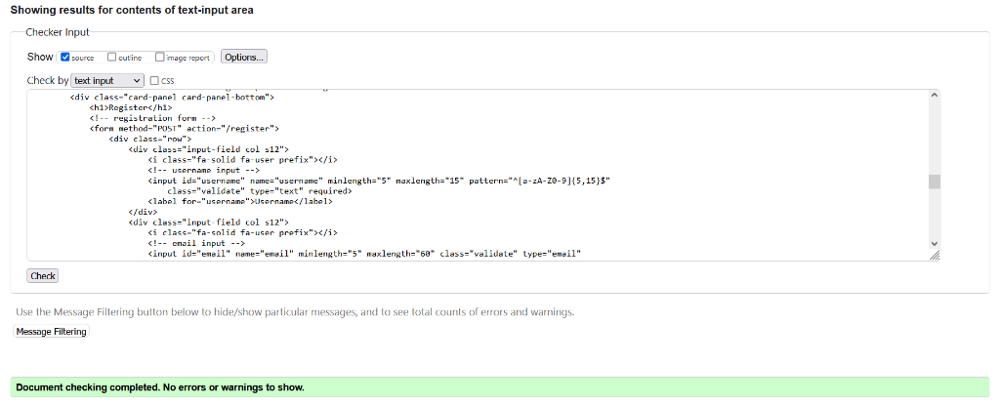        |                     |
| login.html           | 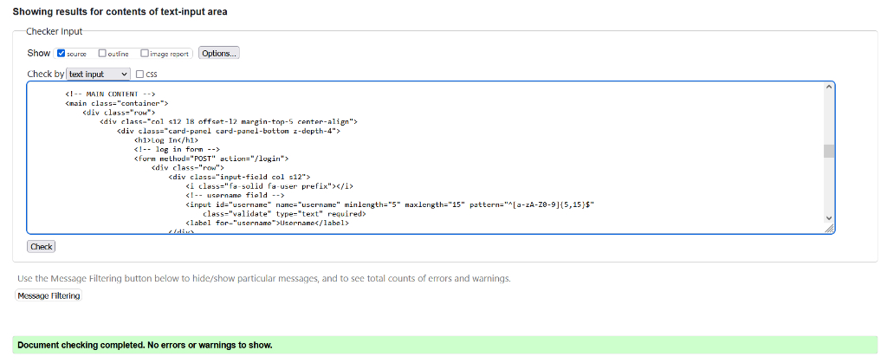           |                     |
| workout_log.html     | 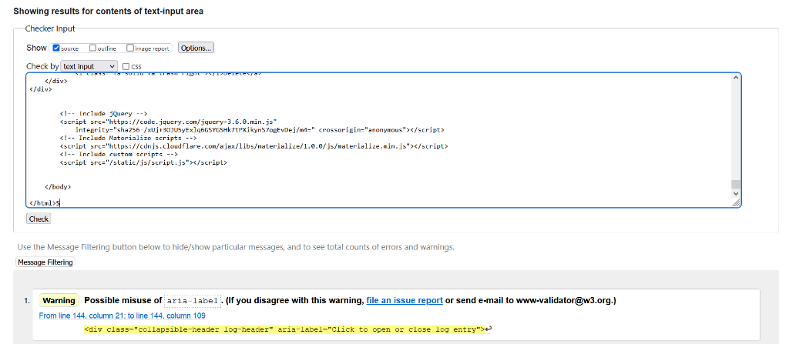     | Aria label warnings |
| add_workout.html     | 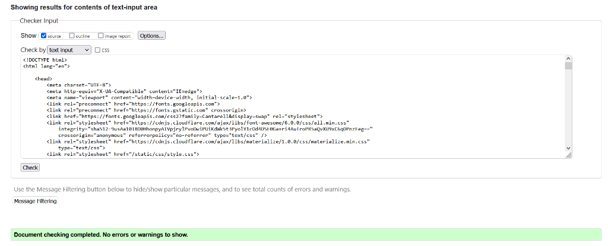     |                     |
| edit_workout.html    | 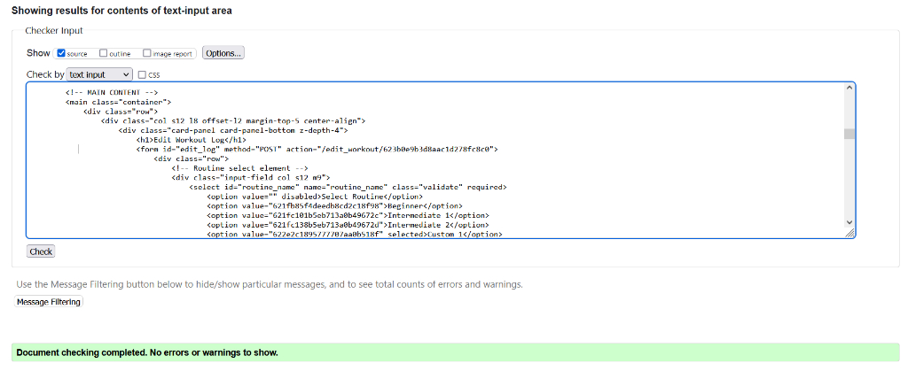    |                     |
| my_routines.html     | 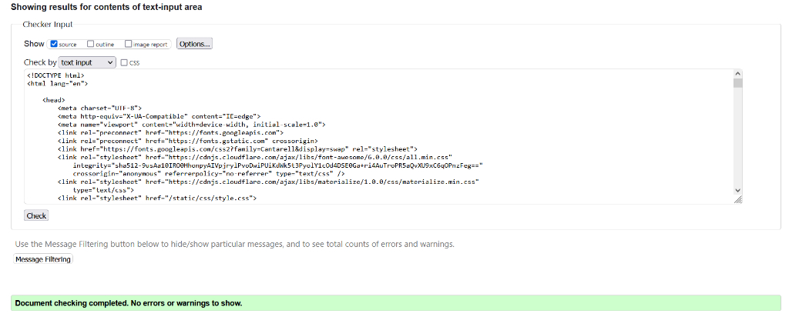     |                     |
| add_routine.html     | 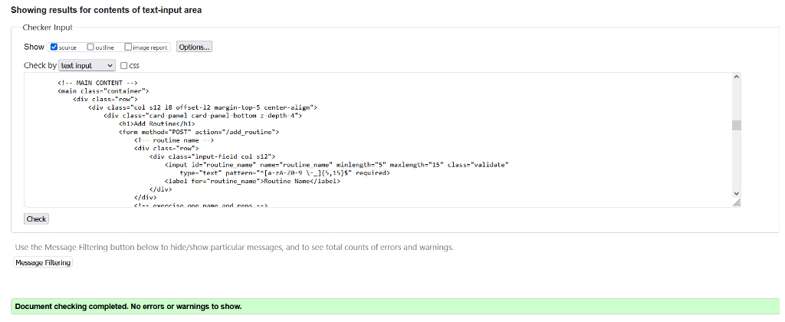     |                     |
| edit_routine.html    | 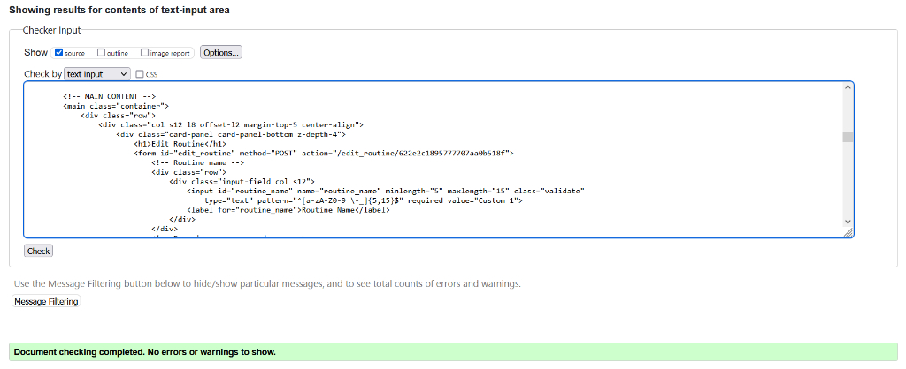    |                     |
| track_progress.html  | 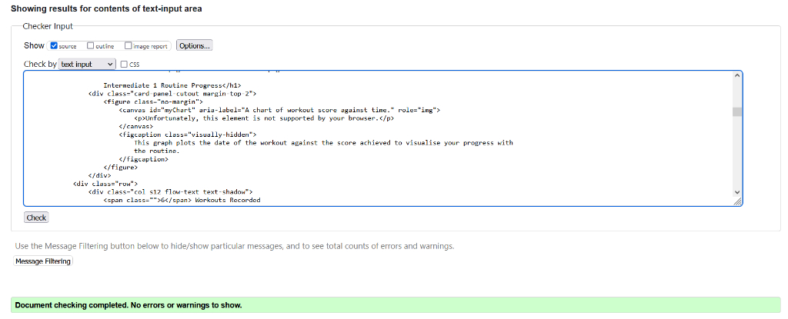  |                     |
| getting_started.html | 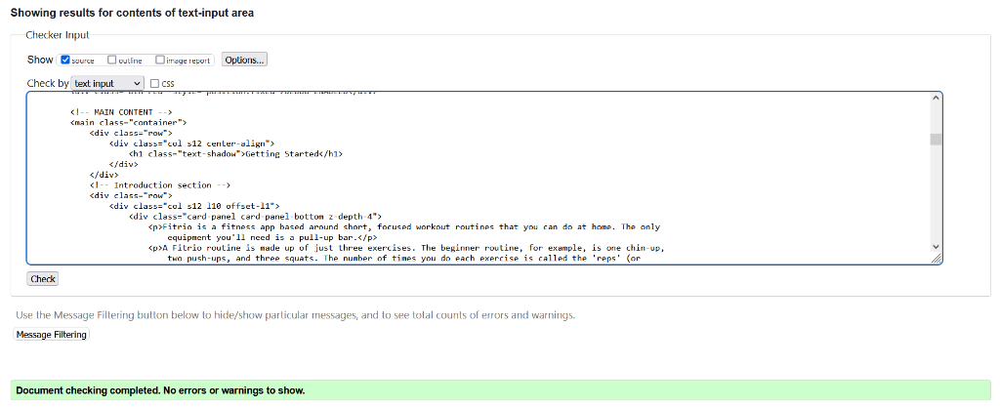 |                     |
| faq.html             | 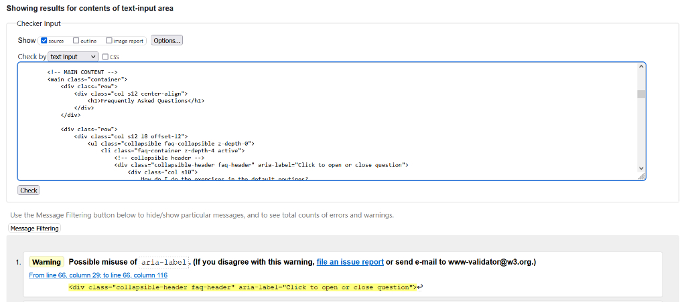             | Aria label warnings |
| 404.html             | 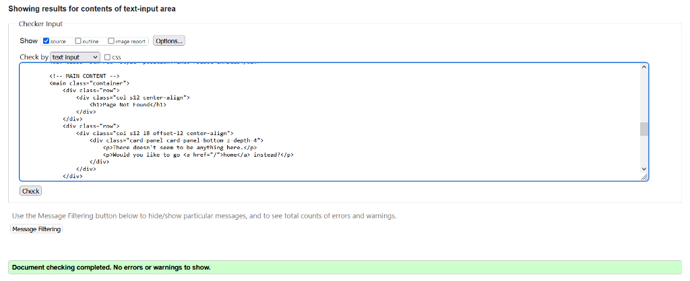             |                     |
| 500.html             | 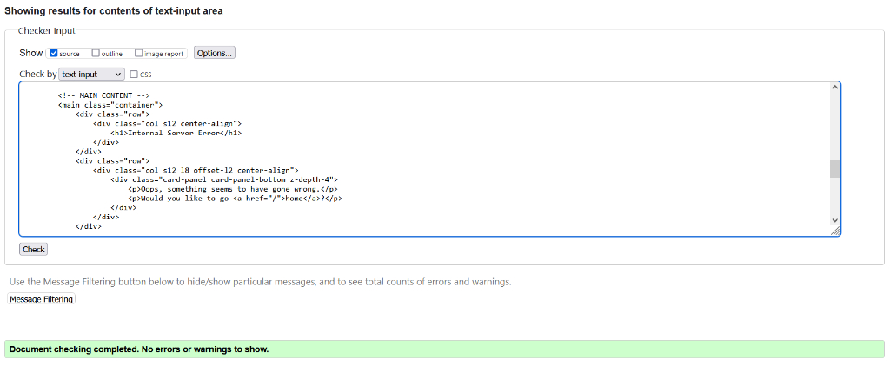             |                     |

All page validation passed with no errors.

A warning was returned for all collapsibles on the FAQ and Workout Log pages, which reads:

"Possible misuse of aria-label. (If you disagree with this warning, file an issue report or send e-mail to www-validator@w3.org.)"

This warning is being raised because I added an aria-label to the header of each collapsible which reads "Click to open or close question/log entry". I think this is appropriate use of the aria-label based on the [W3C Web Content Accessibility Guidelines](https://www.w3.org/TR/WCAG20-TECHS/ARIA14.html):

"elements can be given the attribute aria-label to provide an accessible name for situations when there is no visible label due to a chosen design approach or layout but the context and visual appearance of the control make its purpose clear."

In my case, the collapsible header is an interactive element which opens and closes the collapsible. This behaviour is made clear visually by the chevron symbol on the right side. The aria-label makes the behaviour clear to users who cannot see the symbol.

### CSS Validation

CSS validation passed with no errors or warnings.


### Javascript Validation

Validation of the script.js file passed with no errors or warnings.

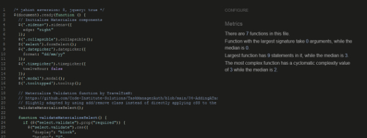

The javascript that renders the chart.js charts on the Track Progress pages contains jinja templating code which would prevent proper validation with JSHint. I therefore validated this code by opening a Track Progress page and copying the code (with injected values from jinja) and pasting that into JSHint.

The code passed validation with two warnings: "One undefined variable - Chart" and "One unused variable - myChart". 

The undefined variable "Chart" is a chart object imported from chart.js and the unused variable "myChart" is used to initialise the chart on the page, so I don't consider the warnings to be an issue.

### Python Validation

Validation of the app.py python file passed with no errors or warnings.

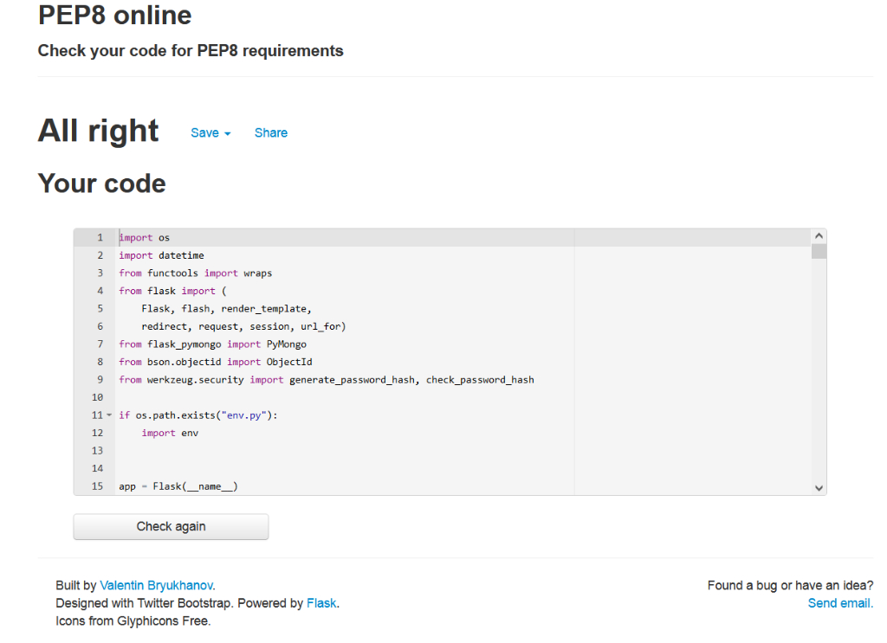

***

## User Stories Testing
### Testing New User Stories

#### As a new user, I want to quickly understand the purpose of the site so that I can decide if it provides value to me.

* The welcome screen on the home page provides a brief overview of the purpose and features of the site to allow new users to quickly asses the value it offers.
* A link to the 'Getting Started' page is included in a prominent position on the welcome screen, which users can follow to find more in-depth information on the application.


#### As a new user, I want to be able to quickly understand how to use the application to meet my needs.

* The 'Getting Started' page contains instructions on how to use the main application features.

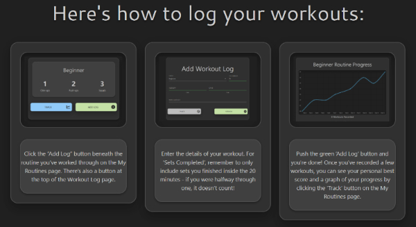

* New users are redirected to this page upon registration of their account. The page is also linked from the Welcome Screen.

* The 'Getting Started' page links to the FAQ, where users can fond more information if needed.


* Both 'Getting Started' and 'FAQ' pages are linked from the nav bar for both logged in and logged out users.


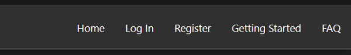

#### As a new user, I want clear instructions on how to perform the featured exercises and record my progress.

* Detailed instructions on how to perform the exercises in the preset routines are included in the top accordion section of the FAQ page, which is open on page load.

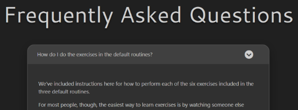

* As well as written descriptions, the FAQ entry has a direct link to a YouTube search for videos showing proper form for each exercise. This is included as many people will find it easier to learn exercises by watching others perform them.

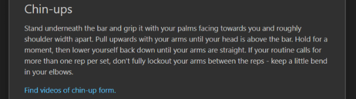)

* Instructions for recording progress are included on the Getting Started page.
* The Workout Log and My Routines pages each have a box at the top of the page containing concise instructions for the features on that page.


#### As a new user, I want to know where to look for more information and help if I don’t understand something.

* The instruction boxes on the workout Log and My Routines pages both have links to the Getting Started guide and the FAQ.

* Links to the Getting Started guide and the FAQ are also provided in the nav bar.

### Testing Returning User Stories

#### As a returning user, I want to be able to quickly access the features I’m interested in.

* It's likely that returning users will usually be logging on to record a new workout, so users are redirected to the Workout Log page upon logging in. This page has a prominent "Add Workout Log" button at the top for adding workouts.

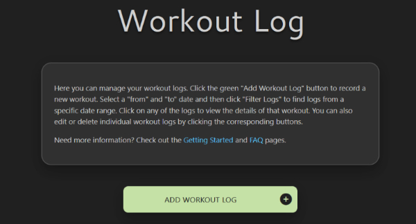

* The nav bar provides quick access to all other features and pages of the site.

#### As a returning user, I want to be able to easily access and manage the data I’ve saved in the application.

* The Workout Log page provides access to all workouts recorded by users.
* Users can expand workout records to view key details and access the delete and edit options.

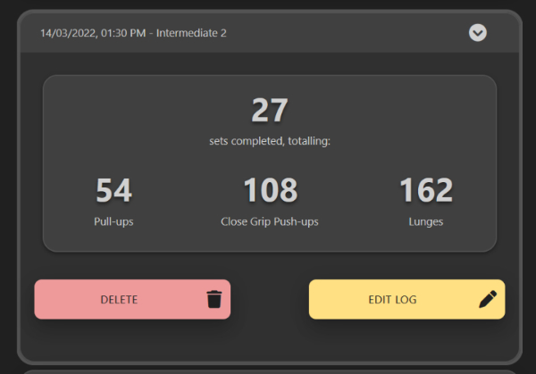

* Edit workout log forms prepopulate with their current data for convenience

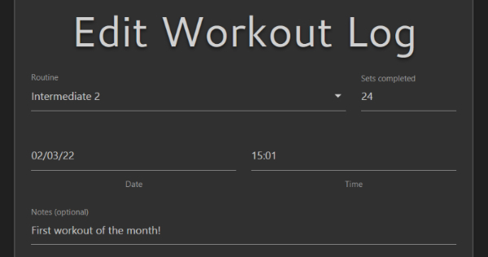

* Workouts on the Workout log are displayed in batches of 10 and paginated so the page doesn't become too large to navigate easily

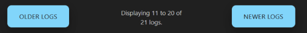

* Users can filter the workout logs by date to help them find the records they're looking for

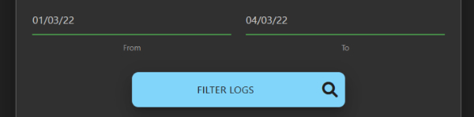

#### As a returning user, I want to be able to create and manage my own custom routines

* The My Routines page allows user to add their own routines


* Routines can be edited or deleted using the buttons on the My Routines page


* Edit routine forms prepopulate with their current data for convenience

#### As a returning user, I want to be able to assess my progress and whether the app is working for me

* Users can assess their progress on the track progress pages, which provide a helpful overview of stored data.


* The graphs provide a clear visualisation of how a user's scores are changinging over time, which allows users to see if their fitness is improving by using the app.

#### As a returning user, I want to be able to share my achievements with others

* All user data is private by default, but users can opt to share their progress with a routine by clicking the "Share Page" button on the track progress pages.


* Once sharing is enabled for a page, users can send the page link to anyone to share their personal best score and progress graph.

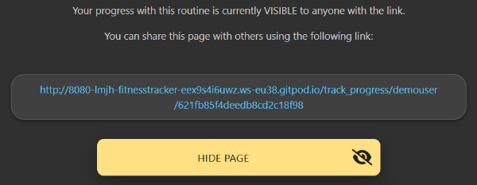

* Users can disable sharing by clicking the "Hide Page" button.

***

## Application Testing


***

## Bugs Fixed

### 1. An error was thrown if a user visited the logout page when already logged out

This was resolved by simply adding the @login_required decorator to the logout function, so logged out users cannot access the page.

### 2. When prepopulating the Edit Workout page with user data, the date and time were being added as full datetime strings

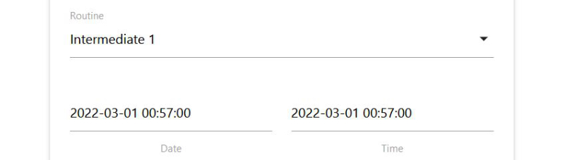

This was fixed by using the strftime() method within the jinja template to covert to the appropriate format for date and time:
```python
{{ log.date.strftime('%d/%m/%y') }}
{{ log.date.strftime('%H:%M') }}
```
### 3. Users could duplicate admin routine names

The code checked if a user had already used a routine name on form submission to prevent duplication, but didn't originally check if they were duplicating an admin routine. This could result in a confusing experience;

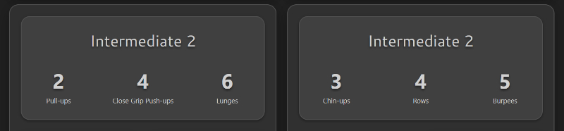

This was resolved by changing the database query that searched for duplicate names to use an $or expression:

```python
find_one(
        {
            "$or": [
                {
                    "username": session["user"],
                    "routine_name": routine_name
                },
                {
                    "username": "admin",
                    "routine_name": routine_name
                }
            ]
        })
```

### 4. The add and edit routine functions were storing "reps" as a string, instead of an int

Because of this, wherever the application tried to display total numbers of exercises by multiplying sets and reps, a long string of numbers was being printed.

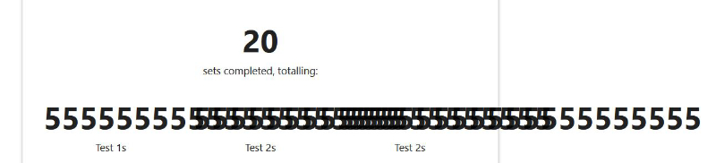

This was resolved by converting the form input to an int on submission:
```python
"exercise_one_reps": int(request.form.get("exercise_one_reps"))
```

### 5. It was possible to enter 0 or negative numbers into the number of sets field when adding workout logs

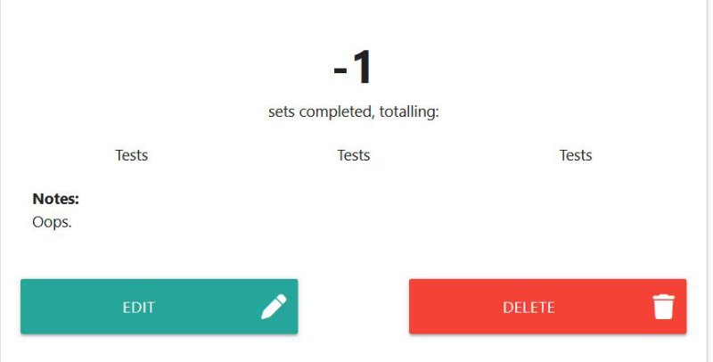

This was resolved by simply adding min="1" to the HTML input elements.

### 6. An error was thrown when users visited the Track Progress page for a routine with no logs

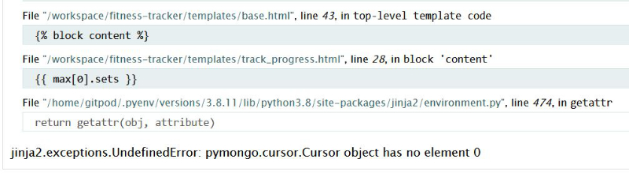

This was resolved by adding a condition to the track_progress function that checks for logs. If no logs are found, users are redirected back to the my_routines page:
```python
if logs:
    # continue function
    # ...

flash("No workouts logged with this routine.", "error")
return redirect(url_for("my_routines"))
```

### 7. Track Progress Personal Best section wasn't displaying the earliest date

The 'Personal Best' section of the Track Progress page displays the date that the best score was achieved. When two scores were the same, however, it would display the first record added to the database, rather than the record with the earliest date, as would be preferred.

This happened because the personal best was being found with a $max database query, and the database was using the ObjectId as a tiebreaker (ObjectIds have a timestamp portion which represents the time the object was created). 

I resolved this by taking an alternative approach to finding the best score. Based on [this answer](https://stackoverflow.com/a/5326622) from StackOverflow, I used the python max() function on the list of logs that I'd already retrieved from the database earlier in the function, which was already sorted by date. I decided this was a preferable solution, as it saved a database query and avoided sorting by date twice.
```python
logs = list(mongo.db.workout_logs.find(
    {
        "$and": [
            {
                "username": username
            },
            {
                "routine_id": ObjectId(routine_id)
            }
        ]
    }).sort("date"))

best = max(logs, key=lambda x: x['sets'])
```

### 8. An error was thrown if users entered invalid data into the date and time pickers

Although basic form validation was in place, it was possible for users to enter invalid data into the date and time pickers (e.g. an invalid date like the 30th of February), which would cause the application to throw an error.


This was resolved by using a try-except block wherever the application converted user input into a datetime object, to handle the error gracefully:
```python
try:
    iso_date = datetime.datetime.strptime(date, "%d/%m/%y%H:%M")
except ValueError:
    flash(
        "Invalid date/time. Please enter a valid date and time in the "
        "formats dd/mm/yy and hh:mm.", "error")
    return redirect(url_for("add_workout"))
```

### 9. Search by date wasn't returning results for the last date entered

When a user entered a 'from' and 'to' date in the Workout Log filter form, any logs recorded on the 'to' date would not be shown. For example, if a user had a workout logged on 07/03/22 and they searched from 01/03/22 to 07/03/22, the workout would not be shown.

This happened because the search function was converting the entered 'from' and 'to' dates into datetime objects and then querying the database for records with a 'date' property greater than the 'from' date and less than the 'to' date:
```python
# convert input to datetime objects 
date_from = datetime.datetime.strptime(
                                request.args.get("date_from"), "%d/%m/%y")
date_to = datetime.datetime.strptime(
                                request.args.get("date_to"), "%d/%m/%y")

# find records between dates
"$match": {
    "username": session['user'],
    "date": {
        "$gte": date_from,
        "$lt": date_to
    }
}
```

Because only a date, and not a time, was being collected for both values, the time part of the datetime objects were defaulting to 00:00:00 - i.e. midnight at the beginning of the date entered. Therefore, any workouts logged after 00:00:00 on the 'to' date were outside the range of the query.

This was resolved by adding "23:59:59" to the date_to string before converting into a datetime object:
```python
date_to = datetime.datetime.strptime(
                                request.args.get("date_to") + "23:59:59",
                                "%d/%m/%y%H:%M:%S")
```

### 10. Mobile menu only visually hidden on larger screens

The mobile menu was visually hidden on larger screens, but remained in the document flow. This was fine for mouse navigation, as the element was simply invisible. 

However, it created a confusing experience for anyone navigating the site by keyboard, as the menu list items were still focusable. This meant that users were effectively forced to tab through the menu twice (once for the visible top nav and once for the invisible mobile nav) before reaching the page content.

This bug was resolved by simply adding the Materialize 'hide-on-large-screens-only' class to the mobile nav, which set the menu's display property to 'none', effectively removing it from the document flow.

### 11. My Routines page displaying the default routines twice for admin account

Because the My Routines page was set up to iterate through all admin added routines and then all routines added by the current user, when the current user was admin, the admin routines were added twice.

This bug was fixed by adding an if condition to the jinja template so that the first iteration wasn't run when admin was logged in:
```python

```

### 12. Window view returned to top of Workout Logs page when pagination controls used

When users clicked on "Older Logs" or "Newer Logs" to cycle through paginated records on the Workout Logs page, the window view would return to the top of the page. This created a frustrating user experience, as users would have to scroll down past the title, description and filters every time they changed page. 

This was resolved by adding an element id to the workout logs results section and adding that element to the older/newer pagination links. Now when the links are clicked, the user is taken directly to the results.

### 13. Entering invalid data into flask route parameters caused errors

The edit_workout, delete_workout, edit_routine, delete_routine, track_progress, and toggle_sharing pages all use route parameters to specify which records should be operated on. An error would be thrown if a user entered invalid data into these functions.


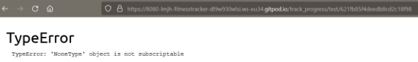

This was fixed by adding code to each function to check the data is valid. Submitted usernames are validated by querying the database and submitted log and routine ids are validated by using the ObjectId.is_valid() function. Users are redirected if invalid data is entered. e.g. from the track_progress function:
```python
# find the page owner in the users database
user = find_user(username)

# if username is not valid or routine id is not valid, redirect to
# my_routines
if not user or not ObjectId.is_valid(routine_id):
    flash("Invalid Username or Routine ID.", "error")
    return redirect(url_for("my_routines"))
```

### 14. Removing 'to_date' parameter from Workout Log URL caused an error


This happened because the code was only checking for a 'from_date' before executing code on the 'to_date', assuming a to_date would always be present. I resolved this by refactoring the code slightly and adding an 'and' condition to the if block to check that the to_date was present:
```python
# retrieve date_from and date_to values from query parameters if available
# and assign to variables
date_from = request.args.get("date_from")
date_to = request.args.get("date_to")
# if date_from and date_to query parameters were found
if date_from and date_to:
```

### 15. Error thrown if user entered an unmatching but valid Object Id into the URL

The edit_workout, delete_workout, edit_routine and delete_routine functions were checking if the variable in the URL was a valid object Id, but not if it matched any records. This meant that errors could be thrown if users entered an object id that was of a valid form, but not matching any documents in the database.

This was resolved for the edit_routine and delete_routine functions by adding error handling to the helper function that retrieves routines so an exception is raised if no record is found:
```python
if routine is None:
    raise ValueError('Invalid Routine Id')
```

Then adding a try except block to the edit_routine and delete_routine functions:
```python
try:
    routine = find_routine(routine_id)
except ValueError:
    flash("Invalid Routine ID.", "error")
    return redirect(url_for("my_routines"))
```

The bug was resolved for the edit_workout and delete_workout functions by adding a find_log helper function with the same functionality.

### 16. Messy generated HTML caused by poor white space control in jinja.

While validating the site code, I noticed that the layout of the HTML generated by my jinja templates was quite messy, with inconsistent indentation and many unnecessary empty lines.

I improved the layout of the generated HTML by using white space removal tags:
```python
# Strips all white space before and after the content block


```
And indentation filters (based on [this answer](https://stackoverflow.com/a/53775887) on stackoverflow):

```python
# Indents all code between tags by 8 spaces


```
There are still some areas with unneccessary empty lines which could be improved by a more thorough review of the code, but overall the generated HTML is much neater and easier to read now.

Home page generated source code before and after improving layout:


***

## Outstanding Issues

### 1. Accessibility Issues with Materialize select element

The Materialize select element works by hiding the actual select element and replacing it with an input field and unordered list, then using javascript to handle user selections.

Unfortunately, this creates an accessibility issue because the label that's applied to the select element is not transferred to the input field that's genereated by Materialize. Technically, all form elements should have an appropriate label.

The input field is still functional, though, and can be fully navigated by keyboard. In my case, the default option that's active before a user selects an option reads "Select Routine", so this should provide an adequate description of the function of the imput.

Given more development time, I would write some javascript to improve the accessibility of the Materialize select element, or replace it with a more accessible alternative. 